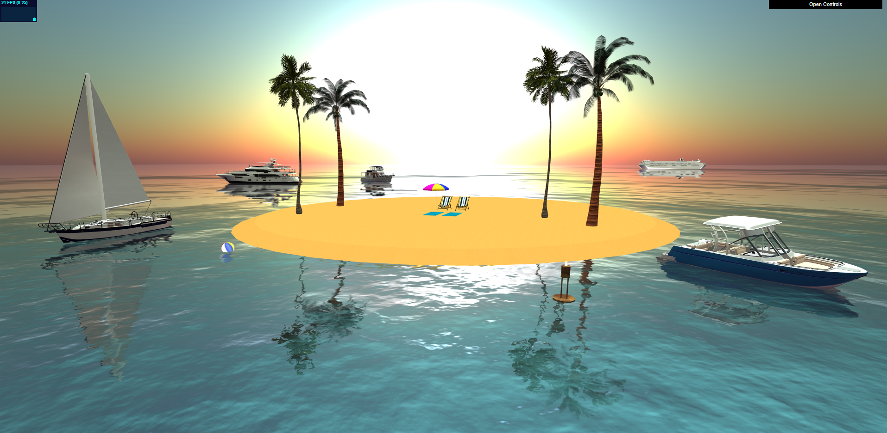

# Virtual Vacation _using WebGL and three.js_
---
#### To run the file: Download the files in this repo and run "island_scene.html" file in a local server (I use a free application called Fenix), make sure all the files and folders are in the same directory. The scene will load and you can see the animations and orbit the camera with the mouse and arrow keys to explore the scene.
# Story

   

An oasis away from the real-world problems of COVID, school, work and whatever may bother you.
In a time when travel is impossible, take a virtual vacation to an island paradise, away from computers, phones, news, and other distractions.
Take a break and imagine you are relaxing on a private island. Maybe you're imagining yourself napping on the beach, or maybe you're taking your boat out, exploring the calm waters surrounding your private island, or maybe you're island hopping on your own private yacht. 
Whatever you choose, it's all set up just waiting for you to enjoy.
Transport your mind to the golden hour and take in the sights of the beautiful reflective ocean water and the colorful setting sun.
